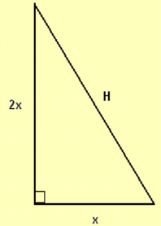
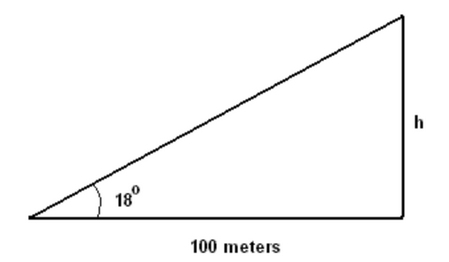
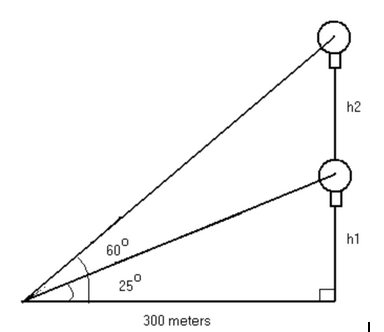
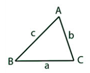
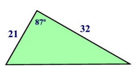
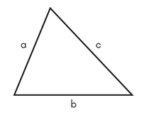
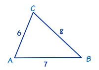

# Chapter 7

## Solving Applied Trigonometry Problems

The above right triangle has an area of 400 m. Solve for all the remaining slides using the information provided. Find the area of the total square so multiply by 2

$$ 400 * 2 = 800 $$

Then use the known sides to find the sides of the square

$$ 800 = 2x * x $$ so then divide by either $$2x$$ or $$x$$ to get $$\frac{800}{2x} = x$$ or $$\frac{800}{x} = 2x$$

Then you use common sense to find $$x = 20$$ making $$2x = 40$$

Using the two found slides of the triangle and the pythagorean theorem  you  can solve for $$ H $$

$$ 20^2 + 40^2 = H^2 $$

$$ H^2 = 2000 $$
$$ H = 2000 $$
$$ H = 44.7 $$

Take the known information and plug it into the matching trig function

In this case the matching function is $$\tan$$

So we get $$\tan{18º} = \frac{h}{100}$$

Multiply both sides by 100 to get $$h$$ alone

$$ H = 100 * \tan{18º}$$

$$ H = 32.5 $$

For this problem we are looking to find both $$h_{1}$$ and $$h_{2}$$. We can easily find both by using trig functions. For $$h_{1}$$ we have an angle the opposite side and the adjacent side. Which gives us the tan function of $$ \tan\theta = \frac{a}{0} $$

$$ \tan{25º} = \frac{h_{1}}{300} $$

Multiply by 300

$$ h_{1} = 300 * \tan{25º} $$
$$ h_{1} = 140 $$

## Law of Sines

When solving unknown dimensions of an oblique triangle, **SOH CAH TOA** does not apply because there is no right angle. For these problems, the Law of Sines is useful.

$$ \frac{\sin{A}}{a} = \frac{\sin{B}}{b} = \frac{\sin{C}}{c} $$

The Law of Sines is useful when any of these cases apply:
- There is a matching side/angle pair
- The problem gives two angles and a side (Angle-Side-Angle and Angle-Angle-Side)
- The problem gives two sides and an angle (Side-Side-Angle) *If so, it is an ambiguous case of the Law of Sines.*

Ambiguous cases of the Law of Sines are problems in which the Law of Sines does not apply. In side-side-angle problems, it is not always apparent that the given information can form a triangle. For that reason, it is important to determine whether or not the Law of Sines applies.

To do so, create a right triangle within the dimensions of the triangle.

From the resultant right triangle, the height of the triangle can be determined using trigonometric functions of a right triangle.

When the side opposite the given angle is <u>shorter</u>`than the height, the triangle has <u>no solutions</u>.

When the side opposite the given angle is <u>the same</u> length as the height, the triangle has <u>one solution</u>.

When the side opposite the given angle is <u>longer</u> than the height, the triangle has <u>at least one solution</u>.

## Law of Cosines

A method to solve the missing parts of a triangle, with fewer conditions than the Law of Sines.

$$ c^2 = a^2 + b^2 - 2ab(\cos{C}) $$

Conversely:

$$ a^2 = b^2 + c^2 - 2bc(\cos{A}) $$

$$ b^2 = a^2 + c^2 - 2ac(\cos{B}) $$

## Finding The Area of a Triangle Using Trigonometry

There are 2 triangle theorems in which the area can be found using trigonometry: side-angle-side (SAS) & side-side-side (SSS)

For SAS problems:

Depending on what 2 sides and angle you are given, the formula to find the area can be any of the following:

- Sides a and b are given, and Angle C is given: $$ \frac{1}{2} ab (\sin{C}) $$

- Sides b and c are given, and Angle A is given: $$ \frac{1}{2} bc (\sin{A}) $$

- Sides a and c are given, and Angle B is given: $$ \frac{1}{2} ac (\sin{B}) $$

To solve for the area, you would simply plug in the values given to you into the formula, and the final product is the area. 

Example: 

1. In this case we will assume that side a = 21, side b = 32, and angle c = 87 degrees. 

2. Now we will use the formula: ½ (a)(b)sin(C) , and plug in all the values: $$ \frac{1}{2} (21)(32) \sin{87°} = 335.54 $$

3. The area is 335.54 sq. units

For SSS problems:

To solve SSS triangles, use Heron's formula:

$$ k = \sqrt{s(s-a)(s-b)(s-c)} $$

In this problem, $$k$$ is the area of the triangle, $$s$$ is the semi-perimeter (half of the perimeter), and $$a$$, $$b$$, and $$c$$ are each sides of the triangle.

Example:

1. Find the semi-perimeter: $$(6+7+8)/2 = 10.5$$

2. Use Heron’s Formula and plug in all the values: $$ k = \sqrt{10.5(10.5-6)(10.5-7)(10.5-8)} $$

3. Simplifying the equation, the area is 20.33 sq. units

### Resources

[Solving Triangles with Trigonometry Examples](https://mathbits.com/MathBits/TISection/Trig/AreaTrigTri.htm)

[Using Heron's Formula to Find Area](https://www.dummies.com/education/math/trigonometry/how-to-find-the-area-of-a-triangle-for-sss-using-herons-formula/)

[Worked Example Video: Finding Area of Oblique Triangles](https://www.youtube.com/watch?v=vlyPt6j5e_uhE)
