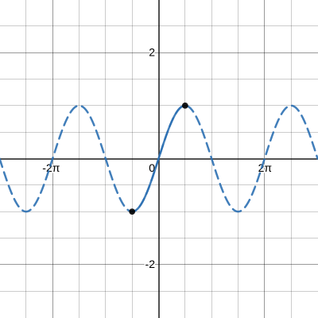

# Chapter 6

## Domain Restrictions of Trigonometric Functions

$$ \sin^{-1}(x) $$|$$ [-1,1] $$|
$$ \cos^{-1}(x) $$|$$ [-1,1] $$|
$$ \tan^{-1}(x) $$|$$ [-\infty,\infty] $$|

When drawing an inverse sine, cosine or tangent graph you must first determine the restrictions on the graph. Before you can inverse the graph you must look for an area that passes the horizontal line test. Then you must restrict the equation to this area. Then you can take the inverse without any problems.

ex: $$ y=\sin x $$

**Step 1:** Find an area that passes the horizontal line test.

In this example, that would be $$ [-2\pi,2\pi] $$.

**Step 2:** Take that section of the graph and invert it.

**Step 3:** Record the domain and range of the inverted area.

Equation: $$ y=\sin^-1(x) $$
Domain: $$ [-1,1] $$
Range: $$ [-\frac{\pi}{2}, \frac{\pi}{2}] $$

### Tips

- The domain and range of the inverted function will be switched from that of the parent function.
- Every point on the parent function has its inverse (x and y swapped) on the inverted function.

### Resources

[Video: Inverse sine, cosine, and tangent](https://www.onlinemathlearning.com/inverse-sine-cosine-tangent.html)

## Finding Composite Trigonometric Values

Composite trig functions are essentially functions inside of a function. We will then solve these to find the composite trig values. These are the properties:

$$
\sin^{-1}(-x) = -\sin^{-1} x, x \in [-1, 1]

\tan^{-1}(-x) = -\tan^{-1} x, x \in ℝ

\cos^{-1}(-x) = -\cos^{-1} x, |x| \geq 1

\cos^{-1}(-x) = \pi - \cos^{-1} x, x \in [-1, 1]

\sec^{-1}(-x) = \pi - \sec^{-1} x, |x| \geq 1

\cot^{-1}(-x) = \pi - \cot^{-1} x, x \in ℝ
$$

## Solving Trigonometric Equations

The goal of solving trigonometric equations is to find the value or solution set of $$\theta$$. Trig equations can be solved similarly to solving a normal equation to find the unknown value. The steps are:

1. Isolate the unknown value
2. Using the unit circle, find the solution set to the equation
3. To find the other values, add the period to each value of the solution set.

ex: $$ 2\sin\theta+3=2 $$

**Step 1:** Subtract the constant value of 3 from both sides of the equation.

$$ 2\sin\theta=-1 $$

**Step 2:** Next, simplify by dividing both sides of the equation by 2.

$$ \sin\theta=-\frac{1}{2} $$

**Step 3:** Using the unit circle, find the two theta values or the solution set that complies with the above. In this case, they are $$ \frac{7\pi}{6} $$ & $$ \frac{11\pi}{6} $$.

**Step 4:** Add the period to the two values to get the remaining values. The period of sine is $$2\pi$$, so $$2\pi$$ will be added.

We are left with the values $$ \frac{7\pi}{6} $$, $$ \frac{11\pi}{6} $$, $$ \frac{19\pi}{6} $$, $$ \frac{23\pi}{6} $$.

### Resources

[Video: How to solve trig equations](https://www.youtube.com/watch?v=eZPEW2hVUd0)
[Examples: Solving simple (to medium-hard) trig equations](https://www.purplemath.com/modules/solvtrig.htm)

## Solving Trigonometric Identities

In order to solve a Trigonometric Identity, the goal is to prove that one side of an equation is equal to the other side. A trigonometric identity is not proven to be equal, so unlike inequalities, you are only allowed to manipulate one side of the equation at a time, and not both at the same time.

ex: $$\tan\theta(\cos\theta)=\sin\theta$$

In order to solve this identity, we attempt to simplify one of the sides using the trigonometric identities covered in chapter 5 in order to make it exactly equal to the other. We always try to simplify the more complicated side, as trying to make the simpler side more complicated is much more difficult. As the complexity increases, it becomes harder to tell which side is the more complicated one, and you may have to toy with changing both sides in order to solve the identity. In this case, we only have to change $$\tanθ$$ to $$\frac{\sin\theta}{\cos\theta}$$ using the quotient trig identity and then multiply to prove this identity true.

ex: $$\frac{\sin\theta}{\cos\theta} * \cos\theta = \sin\theta$$ becomes $$\sin\theta = \sin\theta$$

Generally speaking, you always want to try and change things to sine and cosine. This is not always the solution, but it will get you pretty far most of the time. Let's work through another example.

ex: $$\cos\theta+\sec\theta=\frac{\cos^{2}\theta+1}{\cos\theta}$$

First, we want to separate $$\sin^{2}$$ and 1 to make them easier to work with.

$$ \cos\theta+\sec\theta=\frac{\cos^{2}\theta}{\cos\theta}+\frac{1}{\cos\theta} $$

Then, we want to simplify the $$\frac{cos^{2}\theta}{\cos\theta}$$.

$$ \cos\theta+\sec\theta=\cos\theta+\frac{1}{\cos\theta} $$

Finally, we can use the reciprocal trigonometric identities to substitute $$\frac{1}{\cos\theta}$$ with $$\sec\theta$$.

$$ \cos\theta+\sec\theta=\cos\theta+\sec\theta $$

That checks out. We've solved it!

### Tips

- Trigonometric Identities are solved by simplifying until both sides are proven equal.
- It is easier to simplify the more complex side.
- Try changing things to sine and cosine.
- You can only manipulate one side at a time.

### Resources

[Tips: Tips for proving trig identities](https://www.tuitionmath.com/single-post/2016/12/09/11-tips-to-conquer-trigonometry-proving)

## Sum and Difference Formulas

It can be easier to find the exact value of a sine, cosine, or tangent of an angle if you can rewrite the given angle in terms of two angles with known trigonometric values. Using defined angles on the unit circle, called special angles, allows you to do just that.

The sum and difference formulas are as follows:

$$ \cos(\alpha + \beta) = \cos\alpha\cos\beta-\sin\alpha\sin\beta $$|$$ \cos(\alpha - \beta) = \cos\alpha\cos\beta+\sin\alpha\sin\beta $$|
$$ \sin(\alpha + \beta) = \sin\alpha\cos\beta+\cos\alpha\sin\beta $$|$$ \sin(\alpha - \beta) = \sin\alpha\cos\beta-\cos\alpha\sin\beta $$|
$$ \tan(\alpha + \beta) = \frac{\tan\alpha + \tan\beta}{1 - \tan\alpha\tan\beta} $$|$$ \tan(\alpha - \beta) = \frac{\tan\alpha - \tan\beta}{1 + \tan\alpha\tan\beta} $$|

ex: Find the sine of 15°.

To get 15°, we can use the difference between 45° and 30°, which are defined on the unit circle for us.

Substituting in the angles gives us

$$ \sin15° = \sin(45°-30°) = \sin45°\cos30° - \cos45°\sin30° $$

Using the known values for 45° and 30° from the unit circle, we get

$$ \sin15° = \frac{\sqrt{2}}{2}(\frac{\sqrt{3}}{2}) - \frac{\sqrt{2}}{2}(\frac{1}{2}) $$

This multiplies out to

$$ \sin15° = \frac{\sqrt{6}}{4} - \frac{\sqrt{2}}{4} $$

And finally simplifies out to an answer of

$$ \sin15° = \frac{\sqrt{6}-\sqrt{2}}{4} $$

ex: Find the cosine of 75°.

We can get the cosine of 75° by the sum of 45° and 30°, which are defined on the unit circle.

Substituting in the angles gives us

$$ \cos75° = \cos(45° + 30°) = \cos45°\cos30° - \sin45°\sin30° $$

Using the known values for 45° and 30° from the unit circle, we get

$$ \cos75° = \frac{\sqrt{2}}{2}(\frac{\sqrt{3}}{2}) - \frac{\sqrt{2}}{2}(\frac{1}{2}) $$

This multiplies out to

$$ \cos75° = \frac{\sqrt{6}}{4} - \frac{\sqrt{2}}{4} $$

And finally simplifies out to an answer of

$$ \cos75° = \frac{\sqrt{6}-\sqrt{2}}{4} $$

ex: Find the tangent of $$\frac{\pi}{12}$$.

At first glance, it may seem that there are no ways to get a twelfth of $$\pi$$ from the unit circle. But the difference between $$\frac{\pi}{4}$$ and $$\frac{\pi}{6}$$ is actually $$\frac{\pi}{12}$$. You can find this by giving both of them a common denominator of 12 and it will pop out: $$\frac{3\pi}{12}$$ and $$\frac{2\pi}{12}$$.

Knowing this, we can use the difference between $$\frac{\pi}{4}$$ and $$\frac{\pi}{6}$$ to find the tangent of $$\frac{\pi}{12}$$. Substituting them in yields

$$ \tan\frac{\pi}{12} = \tan(\frac{\pi}{4} - \frac{\pi}{6}) = \frac{(\tan\frac{\pi}{4}) - (\tan\frac{\pi}{6})}{1 + (\tan\frac{\pi}{4})(\tan\frac{\pi}{6}) $$

Substituting in the known values for $$\frac{\pi}{4}$$ and $$\frac{\pi}{6}$$ gives us

$$ \tan\frac{\pi}{12} = \frac{1 - \frac{\sqrt{3}}{3}}{1 + 1(\frac{\sqrt{3}}{3})} $$

This simplifies out to

$$ \tan\frac{\pi}{12} = \frac{\frac{3-\sqrt{3}}{3}{\frac{3+\sqrt{3}}{3}} $$

After simplifying and factoring out the fraction, the result is

$$ \tan\frac{\pi}{12} = 2 - \sqrt{3} $$

### Tips

- The sum and difference equations work for both radians and degrees. It even works with both at the same time, just don't mix up which measurement you're checking the unit circle with.

## Double and Half Angle Formulas

TBD

## Chapter Resources

[Worksheet: Sum and difference equations, solving trigonometric problems, and proving identities](https://www.iroquoiscsd.org/cms/lib/NY19000365/Centricity/Domain/118/Class%20Sheet%2043%20Sum%20and%20Difference%20Formulas%20with%20answers.pdf)
